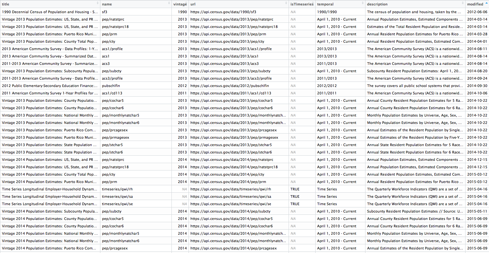

```{r, echo = FALSE}
NOT_CRAN <- identical(tolower(Sys.getenv("NOT_CRAN")), "true")
knitr::opts_chunk$set(purl = NOT_CRAN,
											comment = "#>")
```

`censusapi` is a wrapper for the United States Census Bureau's [APIs](https://www.census.gov/data/developers/data-sets.html). As of 2017 over 200 Census API endpoints are available, including Decennial Census, American Community Survey, Poverty Statistics, and Population Estimates APIs. This package is designed to let you get data from all of those APIs using the same main function—`getCensus`—and the same syntax for each dataset.

`censusapi` generally uses the APIs' original parameter names so that users can easily transition between Census's documentation and examples and this package. It also includes metadata functions to return data frames of available APIs, variables, and geographies.

## API key setup
To use the Census APIs, [sign up](https://api.census.gov/data/key_signup.html) for an API key. Then, if you're on a non-shared computer, add your Census API key to your .Renviron profile and call it CENSUS_KEY. `censusapi` will use it by default without any extra work on your part. 
Within R, run:
```{r, eval = FALSE}
# Add key to .Renviron
Sys.setenv(CENSUS_KEY=YOURKEYHERE)
# Reload .Renviron
readRenviron("~/.Renviron")
# Check to see that the expected key is output in your R console
Sys.getenv("CENSUS_KEY")
```

In some instances you might not want to put your key in your .Renviron - for example, if you're on a shared school computer. You can always choose to specify your key within `getCensus` instead.

## Finding your API
To get started, load the `censusapi` library.
```{r, message = FALSE}
library(censusapi)
```
The Census APIs have over 200 endpoints, covering dozens of different datasets.

To see a current table of every available endpoint, run `listCensusApis`:
```{r, eval = FALSE}
apis <- listCensusApis()
View(apis)
```

This returns useful information about each endpoint, including `name`, which you'll need to make your API call.

## Using `getCensus`
The main function in `censusapi` is `getCensus`, which makes an API call to a given Census API and returns a data frame of results. Each API has slightly different parameters, but there are always a few required arguments:

* `name`: the name of the API as defined by the Census, like "acs5" or "timeseries/bds/firms"
* `vintage`: the dataset year, generally required for non-timeseries APIs
* `vars`: the list of variable names to get
* `region`: the geography level to return, like state or county

Some APIs have additional required or optional arguments, like `time`, `monthly`, or `period`. Check the specific [documentation](https://www.census.gov/data/developers/data-sets.html) for your API to see what options are allowed.

Let's walk through an example getting uninsured rates by income group using the [Small Area Health Insurance Estimates API](https://www.census.gov/data/developers/data-sets/Health-Insurance-Statistics.html), which provides detailed annual state-level and county-level estimates of health insurance rates.

### Choosing variables
`censusapi` includes a metadata function called `listCensusMetadata` to get information about an API's variable options and geography options.
Let's see what variables are available in the SAHIE API:

```{r}
sahie_vars <- listCensusMetadata(name = "timeseries/healthins/sahie", 
	type = "variables")
head(sahie_vars)
```
We'll use a few of these variables to get uninsured rates by income group:

* `IPRCAT`: Income Poverty Ratio Category
* `IPR_DESC`: Income Poverty Ratio Category Description
* `PCTUI_PT`: Percent Uninsured in Demographic Group for Selected Income Range, Estimate
* `NAME`: Name of the geography returned (e.g. state or county name)

### Choosing regions
We can also use `listCensusMetadata` to see which geographic levels we can get data for using the SAHIE API.
```{r}
listCensusMetadata(name = "timeseries/healthins/sahie", 
	type = "geography")
```
This API has three geographic levels: `us`, `county` within states, and `state`.

First, using `getCensus`, let's get uninsured rate by income group at the national level for 2015.
```{r, purl = NOT_CRAN, eval = NOT_CRAN}
getCensus(name = "timeseries/healthins/sahie",
	vars = c("NAME", "IPRCAT", "IPR_DESC", "PCTUI_PT"), 
	region = "us:*", 
	time = 2016)
```

We can also get this data at the state level for every state by changing `region` to `"state:*"`:
```{r, purl = NOT_CRAN, eval = NOT_CRAN}
sahie_states <- getCensus(name = "timeseries/healthins/sahie",
	vars = c("NAME", "IPRCAT", "IPR_DESC", "PCTUI_PT"), 
	region = "state:*", 
	time = 2016)
head(sahie_states)
```

Finally, we can get county-level data. The geography metadata showed that we can choose to get county-level data within states. We'll use `region` to specify county-level results and `regionin` to request data for Alabama and Alaska.
```{r, purl = NOT_CRAN, eval = NOT_CRAN}
sahie_counties <- getCensus(name = "timeseries/healthins/sahie",
	vars = c("NAME", "IPRCAT", "IPR_DESC", "PCTUI_PT"), 
	region = "county:*", 
	regionin = "state:1,2", 
	time = 2016)
head(sahie_counties, n=12L)
```

Because the SAHIE API is a timeseries (as indicated in its name), we can get multiple years of data at once using the `time` argument.
```{r, purl = NOT_CRAN, eval = NOT_CRAN}
sahie_years <- getCensus(name = "timeseries/healthins/sahie",
	vars = c("NAME", "PCTUI_PT"), 
	region = "state:1", 
	time = "from 2006 to 2016")
head(sahie_years)
```

## American Community Survey annotations variable groups
The American Community Survey (ACS) APIs include estimates (variable names ending in "E"), annotations, margins of error, and statistical significance, depending on the data set. Read more on [ACS variable types](https://www.census.gov/data/developers/data-sets/acs-5year/data-notes.html) and annotation symbol meanings on the Census website. 

You can retrieve these annotation variables manually, by specifying a list of variables. We'll get the estimate, margin of error and annotations for median household income in the past 12 months for Census tracts in Alaska.
```{r, purl = NOT_CRAN, eval = NOT_CRAN}
acs_income <- getCensus(name = "acs/acs5",
	vintage = 2017, 
	vars = c("NAME", "B19013_001E", "B19013_001EA", "B19013_001M", "B19013_001MA"), 
	region = "tract:*", 
	regionin = "state:02")
head(acs_income)
```

You can also retrieve also estimates and annotations for a group of variables in one command. Here's the `group` call for that same table, [B19013](https://api.census.gov/data/2016/acs/acs5/groups/B19013.html).
```{r, purl = NOT_CRAN, eval = NOT_CRAN}
acs_income_group <- getCensus(name = "acs/acs5", 
	vintage = 2017, 
	vars = c("NAME", "group(B19013)"), 
	region = "tract:*", 
	regionin = "state:02")
head(acs_income_group)
```

Some variable groups contain many related variables and their associated annotations. As an example, we'll get table [B17020](https://api.census.gov/data/2016/acs/acs5/groups/B17020.html), poverty status by age.
```{r, purl = NOT_CRAN, eval = NOT_CRAN}
acs_poverty_group <- getCensus(name = "acs/acs5",
	vintage = 2017, 
	vars = c("NAME", "group(B17020)"), 
	region = "tract:*",
	regionin = "state:02")
# List column names
colnames(acs_poverty_group)
```

## Advanced geographies

Some geographies, particularly Census tracts and blocks, need to be specified within larger geographies like states and counties. This varies by API endpoint, so make sure to read the documentation for your specific API and run `listCensusMetadata` to see the available geographies.

You may want to get get data for many geographies that require a parent geography. For example, tract-level data from the 1990 Decennial Census can only be requested from one state at a time. 

In this example, we use the built in `fips` list of state [FIPS codes](https://www.census.gov/geo/reference/ansi_statetables.html) to request tract-level data from each state and join into a single data frame.
```{r, purl = NOT_CRAN, eval = NOT_CRAN}
fips
tracts <- NULL
for (f in fips) {
	stateget <- paste("state:", f, sep="")
	temp <- getCensus(name = "sf3",
		vintage = 1990,
		vars = c("P0070001", "P0070002", "P114A001"),
		region = "tract:*",
		regionin = stateget)
	tracts <- rbind(tracts, temp)
}
head(tracts)
```

The `regionin` argument of `getCensus` can also be used with a string of nested geographies, as shown below.

The 2010 Decennial Census summary file 1 requires you to specify a state and county to retrieve block-level data. Use `region` to request block level data, and `regionin` to specify the desired state and county.
```{r, purl = NOT_CRAN, eval = NOT_CRAN}
data2010 <- getCensus(name = "dec/sf1",
	vintage = 2010,
	vars = "P001001", 
	region = "block:*",
	regionin = "state:36+county:027+tract:010000")
head(data2010)
```


## Additional resources
* [Census Data API User Guide](https://www.census.gov/data/developers/guidance/api-user-guide.Overview.html)
* [FIPS codes](https://www.census.gov/geo/reference/ansi_statetables.html)

## Disclaimer
This product uses the Census Bureau Data API but is not endorsed or certified by the Census Bureau.
